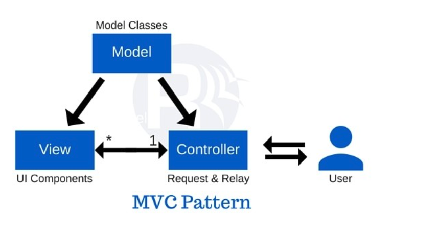
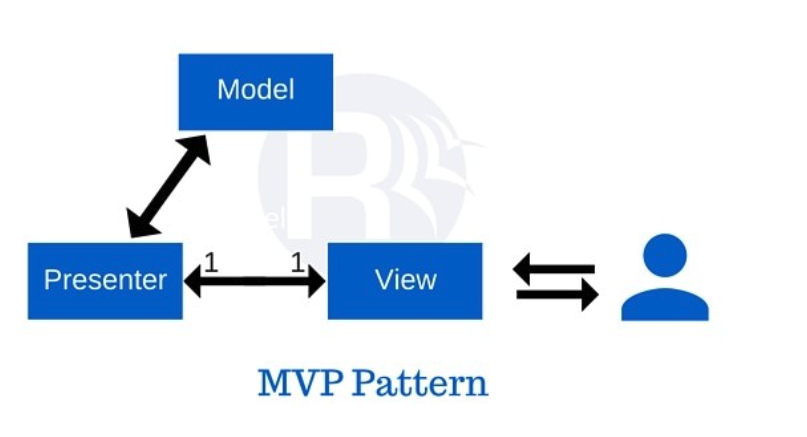

## MVC系列设计模式

* MVC: Model-View-Controller
* MVA: Model-View-Adapter
* MVP: Model-View-Presenter
* MVVM: Model-View-ViewModel

使用MVC系列设计模式, 使用在用户界面开发上. 可以把视图, 模型与控制分离开, 实现松  
耦合设备, 方便重用, 测试与维护

### [MVC](https://en.wikipedia.org/wiki/Model%E2%80%93view%E2%80%93controller)

* Model: 模式的中心组成部分. 它是应用程序的动态数据结构, 独立于用户界面.   
    它直接管理应用程序的数据, 逻辑和规则.

* View: 信息的任何表示形式，例如图表，图表或表格。可以使用同一信息的多种视图  
    ，例如用于管理的条形图和用于会计的表格视图。

* Controller: 接受输入并将其转换为模型或视图的命令.

交互:
* Model负责管理应用程序的数据。它从控制器接收用户输入
* View表示以特定格式表示模型, 需要注册Model的监听
* Controller响应用户输入并在Model对象上执行交互。控制器接收输入，  
    可选地对其进行验证，然后将输入传递给Model

优点:
* Simultaneous development – 多个开发人员可以同时处理模型，控制器和视图
* High cohesion – MVC可以将控制器上相关动作的逻辑分组在一起。特定模型的视图也被分组在一起。
* Loose coupling - MVC框架模型，视图或控制器之间的耦合度很低
* Ease of modification - 由于职责分离，将来的开发或修改更加容易
* Multiple views for a model - 模型可以有多个视图
* Testability - 有了更清晰的关注点分离，可以更好地独立测试每个零件  
    （例如，无需附加视图就可以行使模型）

缺点:
* Code navigability - 框架导航可能很复杂，因为它引入了新的间接层，并要求用户适应MVC的分解标准。
* Multi-artifact consistency - 将特征分解为三个伪像会导致散射。因此，  
    要求开发人员立即保持多个表示的一致性。
* Undermined by inevitable clustering - 应用程序倾向于在用户看到的内容和用户  
    使用的内容之间进行大量交互。因此，每个功能的计算和状态趋向于聚集成三个程  
    序部分之一，从而消除了MVC的优势。
* Excessive boilerplate - 由于应用程序的计算和状态通常被聚类为3个部分之一，  
    其他部分则退化为样板垫片或代码落后，其存在只是为了满足MVC模式。
* Pronounced learning curve - 对多种技术的了解已成为常态。使用MVC的开发人员需要精通多种技术。
* Lack of incremental benefit - UI应用程序已被分解为组件，并且通过组件体系  
    结构实现了代码重用和独立性，而MVC却没有获得增量收益。 

以Android和iOS平台讨论, xml或者storyborad为view层, Activity(Fragment)或者ViewController  
为controller层.
> 在Android和iOS中, View层太单薄, 只能静态显示Model, 如果Model改变那么View层无能为力.  
> 所以需要controller层中设置View的监听实现用户交互, 并且获取View引用, 用来动态设置  
> Model内容. Model中的数据处理, 业务处理一般也会写到Controller层中. 这就造成上面说的  
> `Undermined by inevitable clustering`和`Excessive boilerplate`.
>
> 如果需要完全使用MVC, 那么需要创建Model和View接口ModelImpl和ViewImpl实现, 实别哪些  
> 内容放到三个部分的哪一个部分(MVC中定义不清晰), 然后组合到Controller层. 这样做需要  
> 写很多额外的代码.

### [MVA](https://en.wikipedia.org/wiki/Model%E2%80%93view%E2%80%93adapter)

MVA是MVC的优化, MVC中View为了监听Model的变化, 需要View与Model关联起来, 添加了  
耦合度, 并且不利于复用.

MVA使Controller变成adapter, view和model都与adapter交互, 这样view不需要了解model的格式  
和来源; Model不需要了解View是怎么展示的, 所以不需要特定的组合数据适应View.

另外，可以创建多个适配器以更改一个视图显示给定模型的数据的方式。例如，不同的适配  
器可能会强加不同的原始数据集，进而对相同的基础数据库和相同的向外展示的网站施加不  
同的业务逻辑。在这种情况下，一类各种适配器或中介控制器可以表示同一数据库模型和同  
一网站视图之间的业务逻辑变化。

### [MVP](https://en.wikipedia.org/wiki/Model%E2%80%93view%E2%80%93presenter)

* Model - 该模型是定义要在用户界面中显示或作用的数据的界面。
* View - 该视图是一个被动界面，用于显示数据（模型）并将用户命令（事件）路由到  
    演示者以对该数据进行操作。
* Presenter - 演示者根据模型和视图进行操作。它从存储库（模型）检索数据，  
    并将其格式化以显示在视图中。

MVP跟MVA很像, 都是与Adapter(Presenter)交互, 主要区别在控制流程:
MVP: View会触发/创建/调用Presenter, Presenter将使用Model来响应视图 
MVA: 当收到消息时, 将选择一个适合的Adapter(可以有多个)作为Model和View的中介

### [MVVM](https://en.wikipedia.org/wiki/Model%E2%80%93view%E2%80%93viewmodel)

* Model - 模型是指表示真实状态内容的域模型（面向对象的方法），还是表示内容的数据  
    访问层（以数据为中心的方法）
* View - 就像在模型视图控制器（MVC）模式和模型视图呈现者（MVP）模式中一样，视图  
    是用户在屏幕上看到的内容的结构，布局和外观。[6]它显示模型的表示并接收用户与  
    视图的交互（单击，键盘，手势等），并通过数据绑定（属性，事件回调等）将这些操  
    作的处理转发给视图模型。定义为链接视图和视图模型。
* View model - 视图模型是视图的抽象，公开了公共属性和命令。 MVVM具有绑定程序，可  
    以自动执行视图及其视图模型中绑定属性之间的通信，而不是MVC模式的控制器或MVP模  
    式的演示者。视图模型已被描述为模型中数据的状态。[7] 在MVP模式中，视图模型与  
    Presenter之间的主要区别在于，Presenter拥有对视图的引用，而视图模型则没有。  
    相反，视图直接绑定到视图模型上的属性以发送和接收更新。为了有效运行，这需要绑  
    定技术或生成样板代码来进行绑定。[6]
* Binder - 声明性数据和命令绑定在MVVM模式中是隐式的。在Microsoft解决方案堆栈中，  
    活页夹是一种称为XAML的标记语言。[8]绑定器使开发人员不必编写模板逻辑来同步视  
    图模型和视图。当在Microsoft堆栈之外实现时，声明性数据绑定技术的存在使这种模  
    式成为可能[4] [9]，并且没有绑定器，通常将使用MVP或MVC并必须编写更多样板文件  
    （或用其他工具生成它）。

缺点: 
1. 概括ViewModel是很困难的
2. 大规模的数据绑定会消耗很多内存

## Reference

[Understanding The Difference Between MVC, MVP and MVVM Design Patterns](https://www.linkedin.com/pulse/understanding-difference-between-mvc-mvp-mvvm-design-rishabh-software)
[Understanding Model-View-Controller](https://stefanoborini.com/book-modelviewcontroller/)
