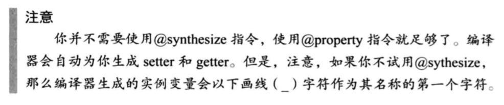

## Grammar

### 1. data

### 2. 运算符
NSLog %%  ‘%’ 转义
隐式转换 - 类型升级
强制转换 - （强制转换）一元运算符 跟取负优先级一样

### 3. 循环

    for (init_expression; loop_condition; loop_expression)
        program statement

    init_expression;
    while ( loop_condition )
    {
        program statement
        loop_expression
    }

    do
        program statement
    while (expression);

    break;
    continue;

### 4. 选择
BOOL YES NO

    if (expression)
        program statement
    else if (expression 1)
        program statement
    else
        program statement

    swich (value):
    case 1:
        break;
    default:
        break;

    condition ? expression1 : expression2
    
    condition ?: expression

### 5. 类

    @interface NewClassName: ParentClassName
        propertyAndMethodDeclarations;
    @end

    @implementation NewClassName
    {
        memberDeclrations;
    }
    methodDefinitions;
    @end

    @property 声明成员变量
    readonly 只读  只生成getter
    readwrite 读写 生成getter setter

    nonatomic 非原子

    assign setter方法一般赋值，引用计算不增加，引用计数为0不会释放
    retain setter方法释放旧的对象，将旧对象的值赋给输入对象，再把输入对象的引用计数+1. ；常常用于NSObject和其子类
    strong 表明这是一个强引用
    weak 表明是一个弱引用，引用计数为0就会释放
    unsafe_unretained 
    copy setter方法复制一个对象

    @synthesize memberName, memberName;// 自动生成存取方法

    

    @class ClassName 同 #import "ClassName.h"
    @class ClassName不引入头文件

    [[ClassName alloc] init];
    [ClassName class]; 通过类名或另一个对象生成一个类对象
    [objec class]; 返回对象类的信

#### 5.1. 初始化

    - (instancetype)init
    {
        self = [super init];
        if (self) {
            // init
        }
        return self;
    }

### 6. 方法

    -(int) set:(int)m :(int)b;  // 可以省参数名

    @selector 指令产生一个SEL类型的值

    @selector (setTo:over:)

### 7. 异常

    @try {
        statemnt
    }
    @catch (NSException *exception) {

    }
    @finally {

    }

    @throw;

### 8. 枚举

    enum month one, two;
    enum month {one, two}; // 有整形值

### 9. 分类

    Fraction+MathOps.h
    @interface Fraction (MathOps) // 不用源代码扩展类的功能
    @implementation Fraction (MathOps)

    @interface Fraction () // 未命名分类，可以定义额外的实例变量和属性来扩展。命名类不允许，方法私有

### 10. 协议
需要

    @protocol NSCopying
    - (id)copyWithZone: (NSZone *)zone;
    @end

    @interface AddressBook: NSObject <NSCopying>

    @optional // 之后的方法是可选的

    [currentObject conformsToProtocol: @protocol (Drawing)] == YES

    id <NSCopying> myCopying;

    // 非正式协议，可以不实现，实现的类需要在@interface中重新声明
    @interface NSObject (NSComparisonMethods)
        method
    @end

### 11. 预处理

    #define 常量
    #import 
    #ifdef,#endif,#else,#ifndef
    #if,#elif,#endif #if defined(DEBUG)
    #undef

### 12. blocks

    void printMessage(void){}
    ^(void){}
    void (^printMessage)(void) = ^(void){}

### static
static 变量 - 静态变量，初始值为0，初始化一次，保留上次的值
static 全局变量 - 不是外部变量
