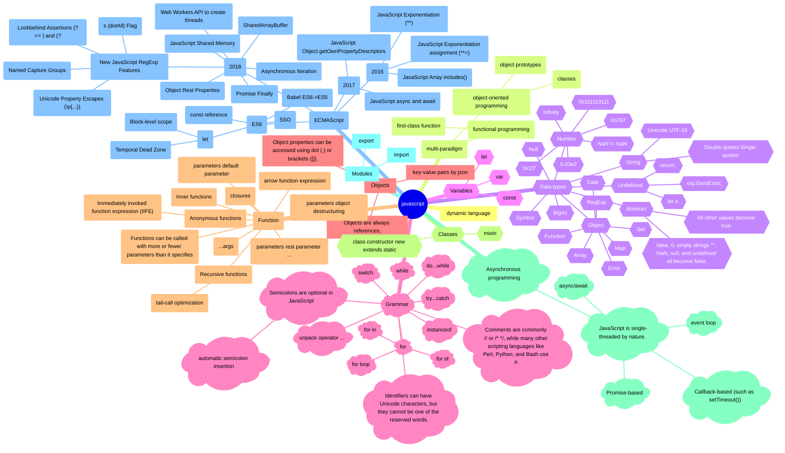

```mermaid
mindmap
    root((javascript))
        [dynamic language]
        (multi-paradigm)
            (object-oriented programming)
                (object prototypes)
                (classes)
            (functional programming)
                (first-class function)
        {{Data types}}
            {{Number}}
                {{0b111110111}}
                {{0o767}}
                {{0x1f7}}
                {{5.03e2}}
                {{NaN != NaN}}
                {{Infinity}}
            {{BigInt}}
            {{String}}
                {{Double quotes Single quotes}}
                {{Unicode UTF-16}}
            {{Boolean}}
                {{false, 0, empty strings "", NaN, null, and undefined all become false.}}
                {{All other values become true.}}
            {{Symbol}}
            {{Undefined}}
                {{return;}}
                {{obj.iDontExist;}}
                {{let x;}}
            {{Null}}
            {{Object}}
                {{Function}}
                {{Array}}
                {{Date}}
                {{RegExp}}
                {{Error}}
                {{Map}}
                {{Set}}
        {{Variables}}
            {{let}}
            {{const}}
            {{var}}
        )Grammar(
            )Identifiers can have Unicode characters, but they cannot be one of the reserved words.(
            )Comments are commonly // or /* */, while many other scripting languages like Perl, Python, and Bash use #.(
            )Semicolons are optional in JavaScript (
                )automatic semicolon insertion(
            )for(
                )for loop(
                )for of(
                )for in(
            )while(
            )do...while(
            )switch(
            )try...catch(
            )instanceof(
            )unpack operator ...(
        [Objects]
            [key-value pairs by json]
            ["Object properties can be accessed using dot (.) or brackets ([])."]
            [Objects are always references,]
        (Function)
            (Functions can be called with more or fewer parameters than it specifies)
            (...args)
            (parameters object destructuring)
            (parameters default parameter)
            (parameters rest parameter ...)
            (Anonymous functions)
                ("Immediately invoked function expression (IIFE)")
            (arrow function expression)
            (closures)
            (Recursive functions)
                (tail-call optimization)
            (Inner functions)
        {{Classes}}
            {{class constructor new extends static}}
            {{mixin}}
        )Asynchronous programming(
            )JavaScript is single-threaded by nature. (
                )event loop(
                )"Callback-based (such as setTimeout())"(
                )Promise-based(
                )async/await(
        [Modules]
            [import]
            [export]
        (ECMAScript)
            (ES6)
                (SSO)
                (Babel ES6->ES5)
                (let)
                    (Temporal Dead Zone)
                    (Block-level scope)
                (const reference)
            (2016)
                ("JavaScript Exponentiation (**)")
                ("JavaScript Exponentiation assignment (**=)")
                ("JavaScript Array includes()")
            (2017)
                ("JavaScript async and await")
                ("JavaScript Object.getOwnPropertyDescriptors")
            (2018)
                ("Asynchronous Iteration")
                ("Promise Finally")
                ("Object Rest Properties")
                ("New JavaScript RegExp Features")
                    ("Unicode Property Escapes (\p{...})")
                    ("Lookbehind Assertions (?<= ) and (?<! )")
                    ("Named Capture Groups")
                    ("s (dotAll) Flag")
                ("Web Workers API to create threads")
                ("JavaScript Shared Memory")
                ("SharedArrayBuffer")
                

```
