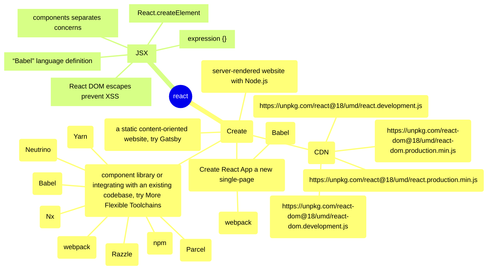

```mermaid
mindmap
    root((react))
        (Create)
            (CDN)
                (https://unpkg.com/react@18/umd/react.development.js)
                (https://unpkg.com/react-dom@18/umd/react-dom.development.js)
                (https://unpkg.com/react@18/umd/react.production.min.js)
                (https://unpkg.com/react-dom@18/umd/react-dom.production.min.js)
            (Create React App a new single-page)
                (Babel)
                (webpack)
            (server-rendered website with Node.js)
            (a static content-oriented website, try Gatsby)
            (component library or integrating with an existing codebase, try More Flexible Toolchains)
                (Neutrino)
                (Nx)
                (Parcel)
                (webpack)
                (Razzle)
                (Yarn)
                (npm)
                (Babel)
        [JSX]
            [components separates concerns]
            ["expression #123;#125;"]
            [React DOM escapes prevent XSS ]
            [React.createElement]
            [“Babel” language definition]
    
```

## References
+ [React Getting Started](https://react.docschina.org/docs/hello-world.html)

