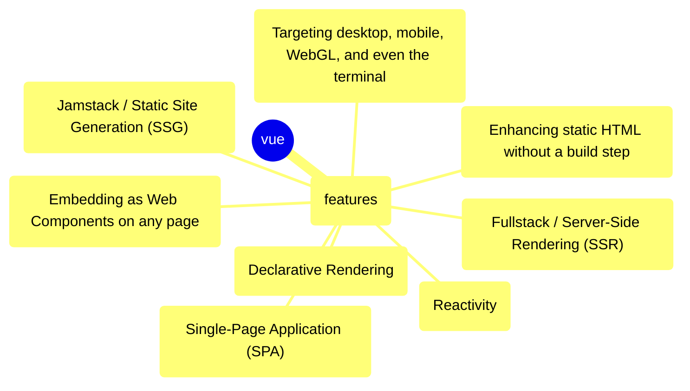

```mermaid
mindmap
    ((vue))     
        (features)
            (Declarative Rendering)
            (Reactivity)
            (Enhancing static HTML without a build step)
            (Embedding as Web Components on any page)
            ("Single-Page Application (SPA)")
            ("Fullstack / Server-Side Rendering (SSR)")
            ("Jamstack / Static Site Generation (SSG)")
            ("Targeting desktop, mobile, WebGL, and even the terminal")


```
